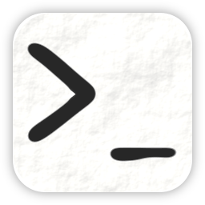

<!--
SPDX-FileCopyrightText: 2026 Dawid Papiewski "SpacingBat3" <spacingbat3@gmail.com>

SPDX-License-Identifier: LGPL-3.0-or-later OR GPL-3.0-or-later
-->

Kontur
========================================================================

A terminal manipulation library for CLI applications.

Description
------------------------------------------------------------------------

Kontur aims to fully implement a terminal manipulation for apps that
don't need entire stack of ANSI sequences for cursor positioning,
alternative screen buffers or component drawing. It also implements
its abstractions to play nice with fresh `std` related traits like
`IsTerminal`.

### Motivation

There are many great and high-quality TUI frameworks for Rust, with
[`ratatui`] being one of notable examples. However, not everything you
might wish to implement might be a TUI and sometimes CLI allows for
more scriptable and faster control interface to both implement and use.

While there are also many terminal manipulations libraries that could
also be integrated into CLI software directly, Kontur is supposed to
provide you a minimalistic API just needed to get a job done, than to
overwhelm you with functionalities you might not neccesarily need when
designing your software. 

### Name Origin

*Kontur* is a Polish word, that means *outline*. It tries to represent
the word *line* in *command-line interface* phrase, to signify that
manipulation focuses not around whole terminal window, but just the
current line of it.

`[feature]` flags
------------------------------------------------------------------------

 - `ascii` – ASCII-focused variants of functions, for programs that
   do not want to handle full unicode support.

 - `unicode` – an unicode-aware text manipulations support, via
   `unicode-width` crate.

[`ratatui`]: https://ratatui.rs/

License
------------------------------------------------------------------------

© 2026 Dawid Papiewski "[SpacingBat3]" <spacingbat3@gmail.com>

This program is free software: you can redistribute it and/or modify it
under the terms of the [GNU Lesser General Public License] as published by
the Free Software Foundation, either version 3 of the License, or
(at your option) any later version.

This program is distributed in the hope that it will be useful,
but WITHOUT ANY WARRANTY; without even the implied warranty of
MERCHANTABILITY or FITNESS FOR A PARTICULAR PURPOSE. See the
[GNU Lesser General Public License] for more details.

You should have received a copy of the [GNU Lesser General Public License]
and a copy of the [GNU General Public License] along with this program.
If not, see <https://www.gnu.org/licenses/>.

[![GPL 3.0 logo]][GNU General Public License] [![LGPL 3.0 logo]][GNU Lesser General Public License]

[SpacingBat3]:                       https://github.com/SpacingBat3
[GNU General Public License]:        https://www.gnu.org/licenses/gpl-3.0.en.html
[GNU Lesser General Public License]: https://www.gnu.org/licenses/lgpl-3.0.en.html
[GPL 3.0 logo]:                      https://www.gnu.org/graphics/gplv3-127x51.png
[LGPL 3.0 logo]:                     https://www.gnu.org/graphics/lgplv3-147x51.png
